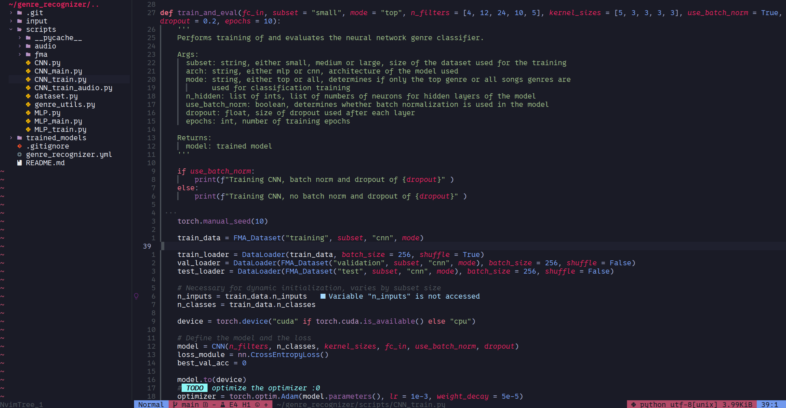

#### About

A dark colourblind-friendly Neovim theme written in lua. For those who enjoy the purples, blues and pinks. 

:we#### Features

Supports plugins such as telescope and NvimTree. 

#### Installation 

**Lazy**
```lua
  {
    'egerhether/heatherfield.nvim',
    config = function()
      require('heatherfield').setup(
        -- custom options
      ) -- calling setup is optional
    end,
  },
```
